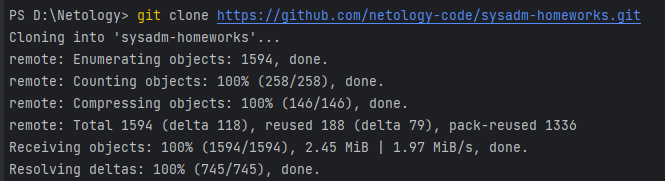
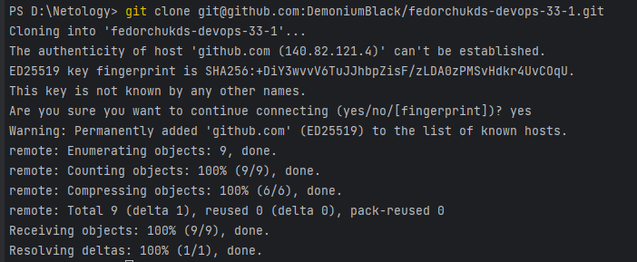
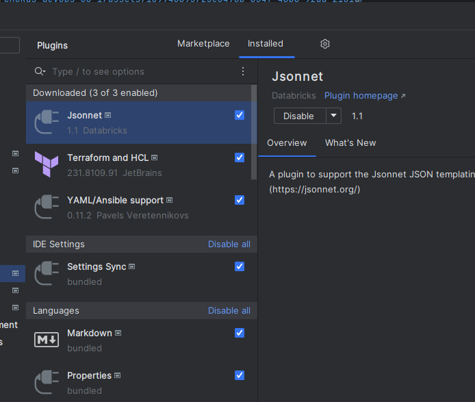
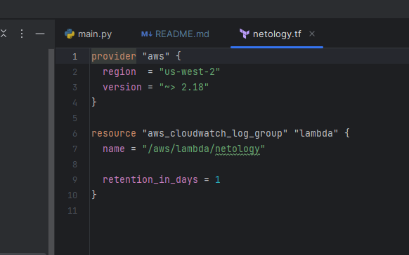
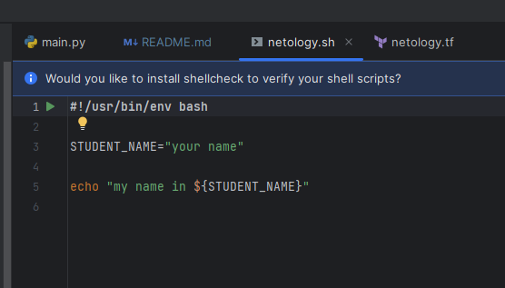
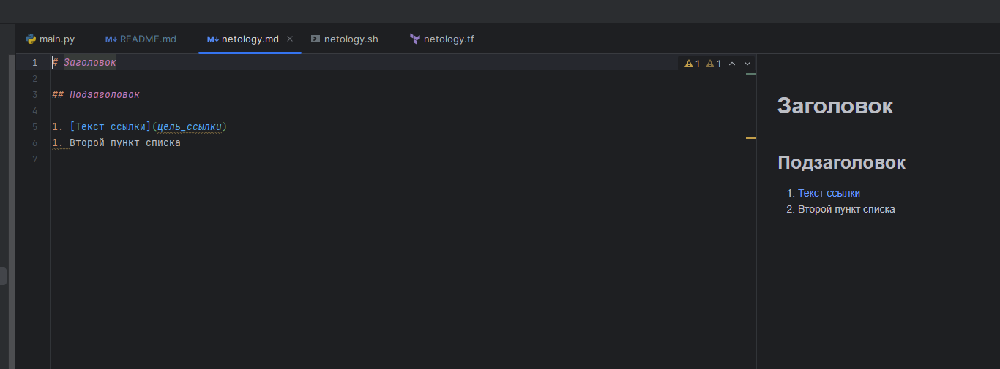
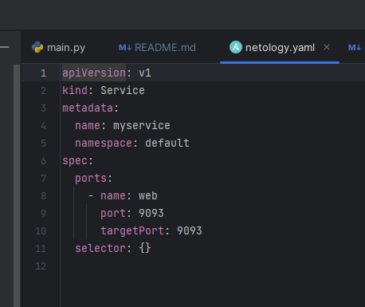
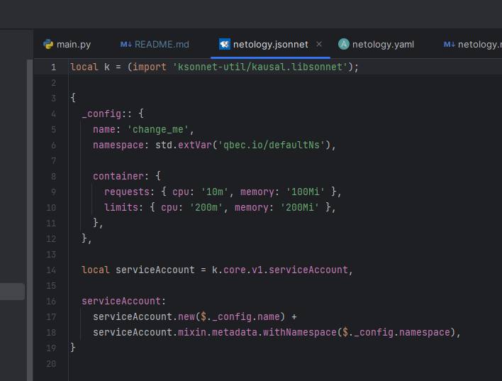

# Домашнее задание по лекции "Введение в DevOps"

## Задание 1. Подготовка рабочей среды

Вы пришли на новое место работы или приобрели новый компьютер. Сначала надо настроить окружение для дальнейшей работы. 

**Что нужно сделать**

**Шаг 1.** Установить [PyCharm Community Edition](https://www.jetbrains.com/ru-ru/pycharm/download/). Это бесплатная версия IDE. В качестве альтернативы можно установить [Visual Studio Code](https://code.visualstudio.com/Download) и дальнейшие шаги проделать в нём. Так вы сможете выбрать более удобный инструмент для себя.

Дальше для примера будут даны скриншоты из PyCharm.

**Шаг 2.** Установить плагины:
* Terraform.
* MarkDown.
* Yaml или Ansible Support.
* Jsonnet.

**Шаг 3.** Склонировать текущий репозиторий (команда `git clone`) или просто создать файлы для проверки плагинов:

* netology.tf — Terraform;
* netology.sh — Bash;
* netology.md — Markdown;
* netology.yaml — YAML;
* netology.jsonnet — Jsonnet.

**Шаг 4**. Убедитесь, что работает подсветка синтаксиса. Файлы должны выглядеть так:

* Terraform: 

* Bash: 

* Markdown: 

* Yaml: 

* Jsonnet: 

*В качестве выполненного задания загрузите скриншоты установленной IDE с плагинами в файле README.md собственного репозитория в GitHub или в Google Doc.*

## Решение 1

Свой выбор IDE остановил на PyCharm Community Edition, т.к. на работе уже использую Visual Studio Code. Интересно открыть для себя новое приложение.

Для более удобной работы с домашним заданием склонировал ваш репозиторий на свой компьютер:

А также зарегистрировался на github и создал свой репозиторий для предоставления отчета по этому заданию.
Склонировал себе на компьютер свой репозиторий для более удобного заполнения отчета.

Установил требуемые плагины:

Проверяю подсветку синтаксиса в предоставленных вами файлах:
* Terraform:

* Bash:

* Markdown:

* Yaml:

* Jsonnet:

Итог: подсветка синтаксиса работает.

## Задание 2. Описание жизненного цикла задачи (разработки нового функционала)

Чтобы лучше понимать предназначение инструментов, с которыми вам предстоит работать, составим схему жизненного цикла задачи в идеальном для вас случае.

### Описание истории

Представьте, что вы работаете в стартапе, который запустил интернет-магазин. Он достаточно успешно развивался, и пришло время налаживать процессы: у вас стало больше конечных клиентов, менеджеров и разработчиков.

Сейчас от клиентов вам приходят задачи, связанные с разработкой нового функционала. Задач много, и все они требуют выкладки на тестовые среды, одобрения тестировщика, проверки менеджером перед показом клиенту. В некоторых случаях вам будет необходим откат изменений. 

### Решение задачи

Вам нужно описать процесс решения задачи в соответствии с жизненным циклом разработки программного обеспечения. Использование конкретного метода разработки необязательно. 

Для решения главное — прописать по пунктам шаги решения задачи (реализации в конечный результат) с участием менеджера, разработчика (или команды разработчиков), тестировщика (или команды тестировщиков) и себя как DevOps-инженера. 

*Ответ пришлите в свободной форме.*

## Решение 2

В первую очередь в ситуации, когда нужно улучшить функционал приложения, я проверю на чем сейчас работает приложение.

Проверять буду все, начиная с "железной" части. Возможно, проект потребуется перенести на отдельный сервер виртуализации, где нет других виртуальных машин, которые способны снизить производительность проекта. Также перенесу проект на отдельный LUN СХД, чтобы не было задержек в его работе из-за низкой производительности дисковой подсистемы.

Потом настрою и отлажу работу системы мониторинга: Zabbix для мониторинга сервера, Telegraf или Prometheus с Grafana для мониторинга отдельных сервисов.
В случае если по системе мониторинга будет видно, что проекту не хватает производительности, то я добавлю ресурсов серверу или виртуальным машинам, на которых развернут проект.

Дальше проверю как запускаются приложения проекта. В случае если приложения проекта запускаются из docker образов или docker-compose файлов, то я создам кластер Kubernetes (K8S) из нескольких нод и перенесу приложения проекта в кластер.
Кластер K8S позволит удобнее управлять ресурсами приложений проекта, также можно будет настроить перезапуск экземпляров приложения при их падении так, что падения приложения будет незаметным для клиента (Kubernetes ReplicaSets).

Также проверю на какой СУБД работает приложение. Сравню текущую СУБД с новой, в случае преимущества новой СУБД перед текущей предложу разработчиками мигрировать БД в новую СУБД. Например, перенести данные из Oracle в PostgreSQL.

В случае, если разработчикам нужные новые инструменты разработки или обновление старых, допустим обновление IntelliJ IDEA до последней версии, я установлю их или выполню обновление на их рабочих компьютерах.
Также узнаю, хватает ли разработчикам производительности их компьютеров. Если не хватает, то с руководством буду прорабатывать вопросы закупки новых комплектующих.

Для хранения и версионирования проекта установлю свой Gitlab в локальной сети, создам и настрою необходимое количество раннеров, создам репозитории, размещу проект в них и настрою права доступа к репозиториям всем разработчикам. Также для удобного деплоя проекта настрою Pipelines. Для хранения и версионирования Docker образов создам локальный Docker Registry и дам туда доступ разработчикам проекта.